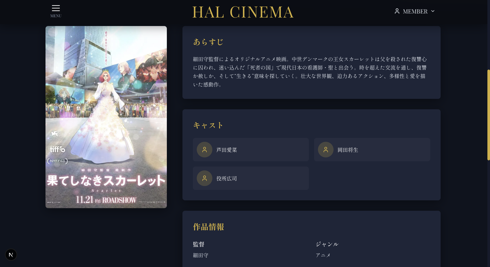
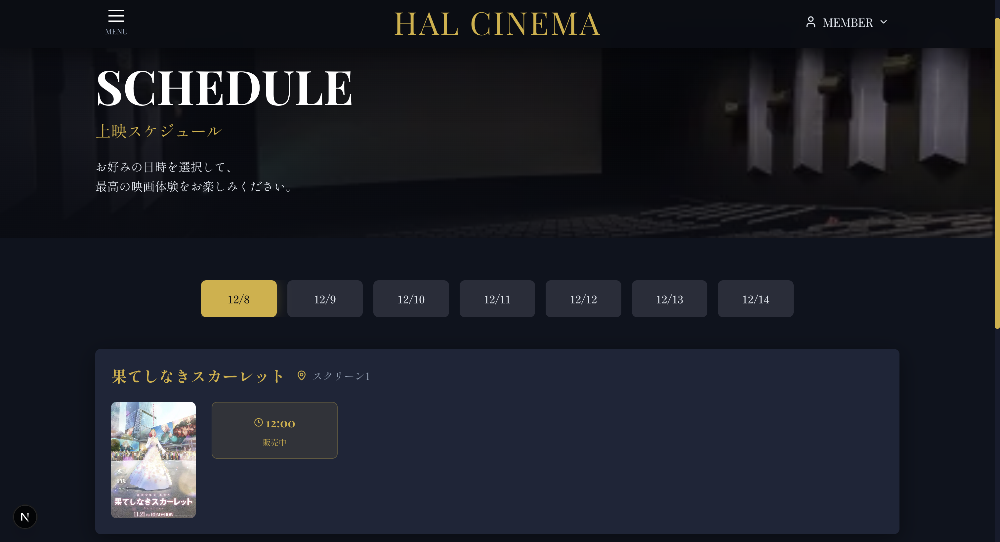
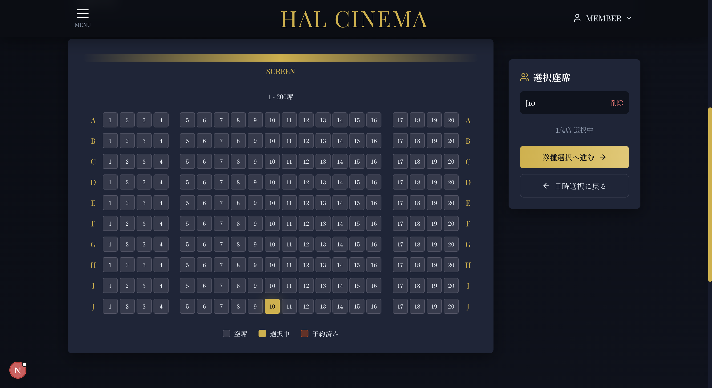
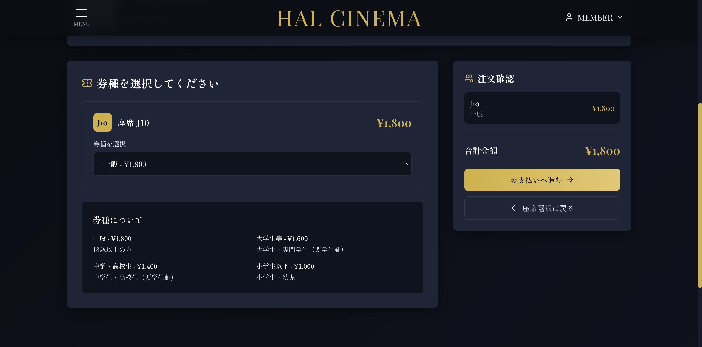
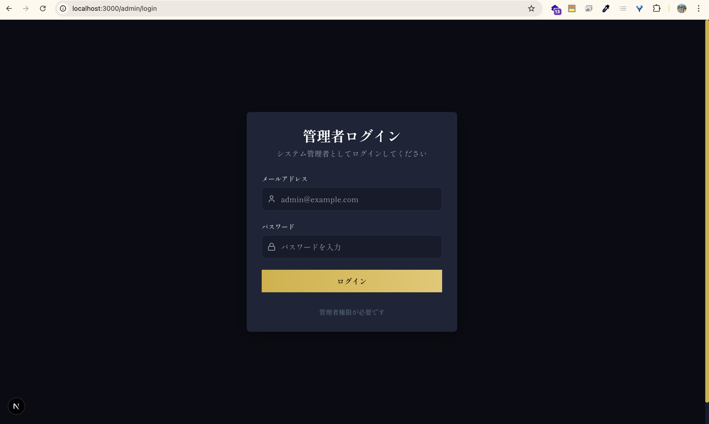
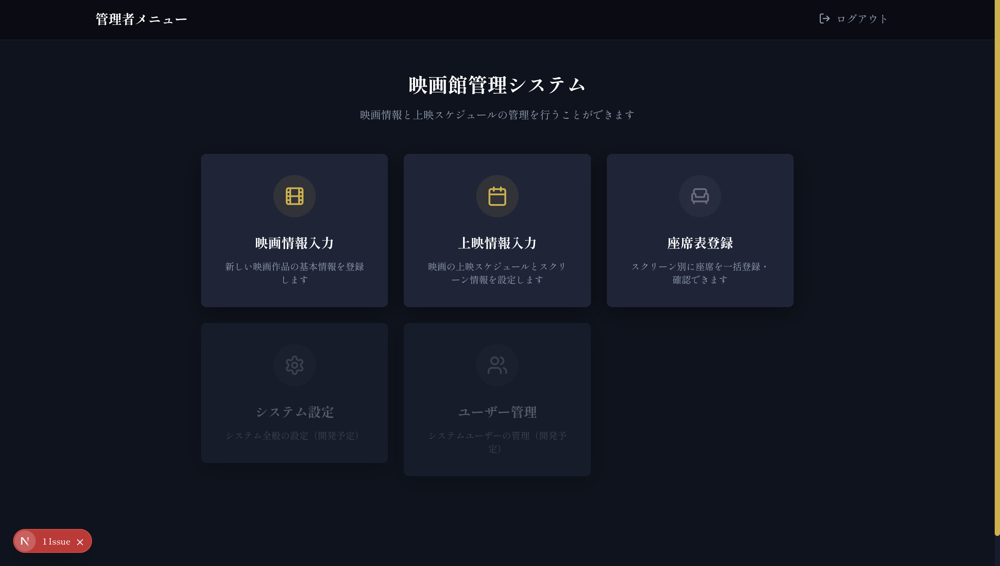

# HALシネマ

## 概要
映画館の上映作品・座席予約・決済・ポスター配信を一元管理するフルスタックプロジェクトです。
バックエンドAPI（Go）と Next.js フロント、PostgreSQL/MongoDB、nginx ファイルサーバーで構成しています。

## 背景
校内チームでのシネマ運営シミュレーション用に、上映作品管理や決済、画像配信などを実装しました。API と管理 UI を共有し、ローカル環境で一通りの動作確認ができるようにすることを目的としています。

## 技術スタック
- フロントエンド: Next.js 15 / React 19 / TypeScript / Tailwind CSS を使用しています。
- バックエンド: Go 1.24 / Gin / GORM を使用しています。
- データベース: PostgreSQL / MongoDB を使用しています。
- その他: Docker Compose / nginx ファイルサーバー / Makefile ユーティリティを併用しています。

## 起動の仕方
1. 環境変数を用意します: `cp back/.env.example back/.env` で必要に応じてポートやDB情報を調整してください。
2. バックエンド一式を起動します: `cd back && make build`（初回のみ）→ `make up` で Postgres・Mongo・file-server・backend を立ち上げます。API は `http://localhost:8080`、ポスター配信は `http://localhost:8081/posters` で確認できます。
3. 管理者ユーザーを作成します: `cd back && make seed-admin` を実行してください（roles投入とAPI疎通を待って自動で管理者を作成します）。必要に応じて `make reset-db` でDBとボリュームを初期化できます。
4. フロントエンドを起動します: `cd front && npm install && npm run dev` を実行し、`http://localhost:3000` で画面を確認してください。

### 管理者作成用 make コマンド（`make seed-admin`）の手順と内部動作
- 実行手順: `cd back && make seed-admin`
- 内部動作（簡潔版）:
  - `make wait-schema` を通じて PostgreSQL が起動し、`roles` テーブルができるまでポーリングします。
  - `make seed-roles` で料金テーブルを挿入・更新します。
  - `curl POST /users/` により `admin@example.com` の管理者候補ユーザーを作成します（既存なら 409 を許容）。
  - 応答ボディまたは `GET /users/` から `admin@example.com` の `user_id` を取得します。
  - `curl POST /admin/promote` で該当ユーザーに管理者権限を付与します（201/409 を許容）。
- 作成される管理者の認証情報: メールアドレスは `admin@example.com`、パスワードは `AdminPass123!` です。初回ログイン後に変更することをおすすめします。
- `make` と `grep` が必須になるため、Windows の場合は `git bash` での実行をおすすめします。

### 画面一覧
#### ユーザー画面
##### トップページ

##### 映画詳細ページ

##### スケジュールページ

##### シート予約ページ

##### チケット予約ページ

##### ユーザーサインナップ・サインイン

#### Admin画面
##### アドミンログインページ

※ `http://localhost:3000/admin/menu` でログインします。
ただし、あらかじめ、メールアドレスがアドミン対象として登録されている必要があります。
##### アドミン管理メニューページ

